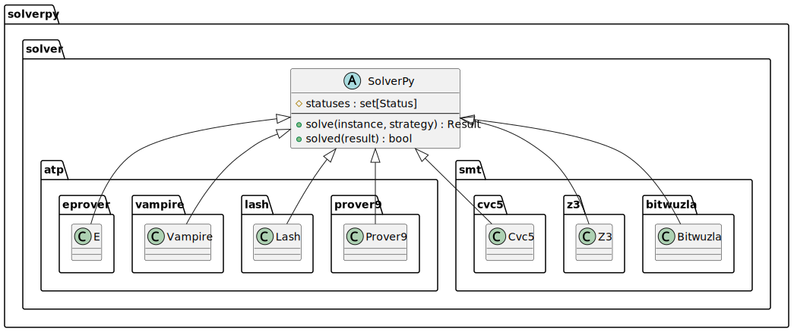

# Python Interface for Automated Solvers

`SolverPy` provides a uniform Python interface for several automated ATP and SMT solvers.

<div class="image-container">
  
</div>

Currently supported solvers are 
[`E`][solverpy.solver.atp.eprover],
[`Vampire`][solverpy.solver.atp.vampire],
[`Prover9`][solverpy.solver.atp.prover9],
[`Lash`][solverpy.solver.atp.lash],
[`cvc5`][solverpy.solver.smt.cvc5],
[`Z3`][solverpy.solver.smt.z3],
and [`Bitwuzla`][solverpy.solver.smt.bitwuzla].

The interface can be used for:

💡 _Solving a single problem_ instance with compatible results.  
🔧 _Benchmark parallel evaluation_ with database storage.  
🧠 _Machine learning_ of models and strategies for solver guidance.  

## Installation

Install the Python package using `pip`:

```sh
$ pip install solverpy
```

Or clone our [GitHub repository](https://github.com/cbboyan/solverpy):

```sh
$ git clone https://github.com/cbboyan/solverpy.git
```

> 🗒️ **Note**: The solver binaries/libraries are not part of this Python
> package and must be installed separately.  The binaries must be (by default)
> in `PATH` or specified using `binary` parameter in `Setup`, if you wish to use them from
> `solverpy`.

## Overview

### 💡 Single problem solving

Single problem solving involves creating a solver object and calling its
`solve` method.

```python
from solverpy.solver.smt.cvc5 import Cvc5

cvc5 = Cvc5("T5")  # time limit of 5 seconds
result = cvc5.solve("myproblem.smt2", "--enum-inst") # problem and strategy
```

_Strategies_ are solver-specific, typically command line options as a string.

☕ The _result_ is a dictionary guaranteed to contain at least two keys: `status` as a string
and `runtime` in seconds, apart from solver-specific keys.

### 🔧 Benchmark evaluation

SolverPy provides dataclass [`Setup`][solverpy.setups.setup] that describes the evaluation configuration.
It auromatically connects to database [`DB`][solverpy.benchmark.db.db] to store results, by default, using the [`Jsons`][solverpy.benchmark.db.providers.jsons] provider.


<div class="image-container">
  
</div>

To evaluate a set of strategies on a set of benchmark problems, you just need to provide your experiment description as a Python `dict`.

> 💡 Use typed version [`Setup`][solverpy.setups.setup] to avoid typos and type errors.

Functions from the [`setups`][solverpy.setups] module are used to fill in the required keys and values.
To run the evaluation you setup a solver for an evaluation, then launch it.

```python
from solverpy import setups

mysetup = setups.Setup(
    cores=4,
    bidlist=['problems'],
    sidlist=["default"],
    limit='T10',
)

setups.cvc5(mysetup)
setups.evaluation(mysetup)

mysetup.launch()
```

🤞 Before launching the evaluation, you need to setup the SolverPy database
by creating directories `solverpy_db/strats` in the current directory.
This directory stores the strategy files.
For the above example, there should be an empty file `solverpy_db/strats/default` (default cvc5 strategy).
The problem files should be in `problems/` directory.

☕ After the evaluation, you can inspect the results in the database directory `solverpy_db/results`.

### 🧠 Machine learning


## Single problem solving

To call the solver on one problem instance, start by creating the solver object.

```python
from solverpy.solver.smt.cvc5 import Cvc5

cvc5 = Cvc5("T5")  # time limit of 5 seconds
```

The constructor argument is a resource limit string, in this case, a time limit `T` in seconds.  All solvers support `T` and additional resource limits might be available depending on the solver.  Multiple resource limits can be used (separated by `-`, like `T10-R50000`).  The limit string must, however, always start with `T`.

Then call the `solve` method:

```python
result = cvc5.solve("myproblem.smt2", "--enum-inst")
```

The first argument is the problem filename, the second is the solver-dependent strategy description (typically command line options as a string).

The result is a Python `dict` with results and statistics.  The keys and values are solver-specific.  Nevertheless, the result always contains keys `status` (with the value of type `str`) and `runtime` (type `float`).

💡 Call `cvc5.run(p,s)` instead of `cvc5.solve(p,s)` to get the raw solver output without any processing.  

💡 Call `cvc5.command(p,s)` to output the shell command that is going to be executed to launch the solver.


## Parallel benchmark evaluation

To evaluate a set of strategies on a set of benchmark problems, you just need to provide your experiment description as a Python `dict` and launch the experiments.

```python
from solverpy.benchmark import setups

mysetup = ...

setups.launch(mysetup)
```

The experiment setup (`mysetup`) must have specific keys.  The module `solverpy.benchmark.setups` contains methods to fill in the required keys and values.

You must specify at least the following:

| key          | type      |   description |
|--------------|-----------|---------------|
| `cores` | `int`  | number of CPU cores to use for parallel evaluation |
| `sidlist` | `[str]` | list of strategies to evaluate |
| `bidlist` | `[str]` | list of problems to evaluate on |
| `limit` | `str` | the resource limit for a single solver run |

### Strategies and _strategy id's_

Strategies are stored in files in the directory `solverpy_db/strats` which must exist in the current working directory (the directory is adjustable by the `SOLVERPY_DB` environment variable).
The filename of each strategy is used to reference the strategy in `sidlist` and it is called the _strategy id_ (`sid`).

Hence, for every `sid` in `sidlist` in `mysetup`, there must be the file `solverpy_db/strats/sid` in the current working directory.
This file contains the strategy definition (typically command line options) to pass to the `solver.solve` method.

### Problems and _benchmark id's_

Benchmark problem sets are represented by _benchark id's_ (`bid`).  The _benchmark id_ is a file path relative to the current working directory (adjustable by the `SOLVERPY_BENCHMARKS` environment variable)
pointing either to a file or to a directory.

If the path leads to a:

* `directory`: Then every regular file _directly_ in this directory is considered a benchmark problem.
   Directories and hidden files are ignored and no recursive search is performed.
   This variant is useful when you have a set of problem files, all in one directory.
* `file`: Then the file consists of lines containing paths to corresponding problem files.
   The paths are relative to the directory of the `bid` file.  For example, if  the `bid` is `myproblems/subset1` and this file contains (among others) the line `category1/problem23.smt2` then the problem must be placed in `myproblems/category1/problem23.smt2` (because the directory of the `bid` file is `myproblems`).
   This variant is useful when your benchmarks are structured in subdirectories and you don't want to merge them into one directory.

### Experiments example

Suppose you have some SMT problems in the directory `myproblems` and that you want to evaluate your cvc5 strategies `buzzard`, `sparrow`, and `chickadee`, which you have placed in the directory `solverpy_db/strats`.  You can download the archive with files for this example [here](https://github.com/cbboyan/solverpy/raw/main/docs/example.tar.gz).

You proceed as follows.  First, you create the description of your experiments in `mysetup`.

```python
from solverpy.benchmark import setups

mysetup = {
    "cores": 4,
    "limit": "T10",
    "bidlist": ["myproblems"],
    "sidlist": ["buzzard", "sparrow", "chickadee"],
}
```

Hint: Add `mysetup["options"] = ["outputs"]` if you want to keep raw solver output files from all solver runs.  

Hint: Options are slightly more described [here](options.md).

Then you specify that you want to use cvc5 and that you wish to launch an evaluation.  These methods update `mysetup` and fill in some keys required by `setups.launch()`.

```python
setups.cvc5(mysetup)
setups.evaluation(mysetup)
```

Finally, you launch the experiments.

```python
setups.launch(mysetup)
```

You will see the progress of the experiments on the screen.  Once finished, you will find the following subdirectories inside `solverpy_db`:

| directory |  content |
|--------------|-----------|
| `results` | Results by each strategy (`sid`) for each `bid`.  The result for each `sid` and `bid` is a JSON file (gzip-ed) with a Python dictionary `{problem: result}`. |
| `solved` | List of solved problem names by each strategy for each `bid`.  One per line, easy to `grep` and `cat`. |
| `status` | Statuses of all problems by each strategy for each `bid`.  Problem name and status at one line, TAB separated.  Easy to `cut`. |
| `log` | Console log for each `solverpy` experiment run. |
| `outputs` | Raw solver output files for each solver run (only if selected). |

Now run the script again and notice that it finished much faster.  It is because the cached results were reused and no solvers were actually launched.  So be careful and always clean the database if you want to force recompute.  Simply delete all the directories in `solverpy_db` except `strats` (see the script `clean_db.sh` in the [example archive](https://github.com/cbboyan/solverpy/raw/main/docs/example.tar.gz)).


